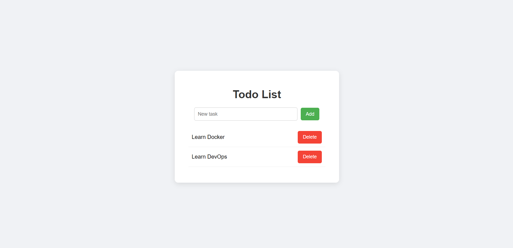

# Docker Multi-Container Todo App

A full Todo List application built using a **3-Tier Architecture** with Docker Compose.

This project demonstrates how to connect:

- Frontend (User Interface)
- Backend API (Node.js + Express)
- Database (MySQL)

All services run in isolated containers and communicate through a shared Docker network.

---

## Architecture

Browser → Frontend → API → MySQL

Each service runs in its own container and communicates internally via Docker networking.

---

## Technologies Used

- Docker
- Docker Compose
- Node.js
- Express.js
- MySQL
- HTML / CSS / JavaScript

---

## Features

- Add a new task
- View tasks stored in database
- Delete a task
- Automatic database initialization
- Container-to-container networking
- One-command startup

---

## 📸 Application Preview

<p align="center">
  
</p>

## Project Structure

```bash
todo-docker-app/
│
├── api/
│   ├── server.js
│   ├── package.json
│   └── Dockerfile
│
├── frontend/
│   ├── index.html
│   └── Dockerfile
│
├── db/
│   └── init.sql
│
├── docker-compose.yml
└── README.md
```


---

## Run The Project

### 1) Clone repository


git clone https://github.com/Yousuf-Almathehaji/todo-docker-app.git

cd todo-docker-app

2) Start containers
docker compose up --build

3) Open in browser
http:// your server IP 
## IF you down have external server use
http://localhost


